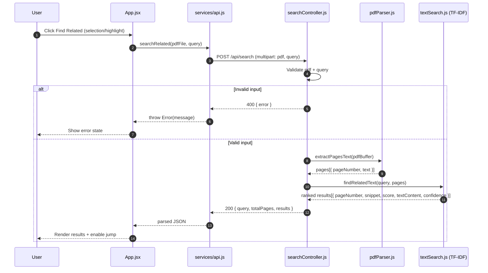
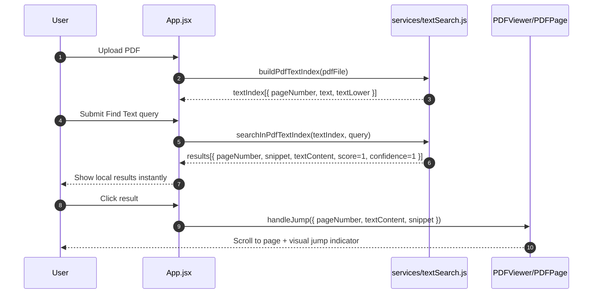

# Feature Explanation (Technical)

This document explains how the current implementation computes results, how each major function works, and what request/response payloads are exchanged.

---

## 1) End-to-End Architecture

- Frontend renders PDF pages and text layer with `pdfjs-dist`.
- Frontend supports three search-related user actions:
  - Highlight from current selection (on demand)
  - Related-text search (calls backend API)
  - Fast Find Text (local in-memory index)
- Backend receives PDF + query, extracts page text, computes TF-IDF ranking, and returns ranked related passages.

---

## 2) Backend: Function-by-Function Logic

### 2.1 `searchRelated(req, res)`
File: `backend/controllers/searchController.js`

Purpose:
- Handles `POST /api/search`.

Input expectations:
- `req.file` (PDF, uploaded as multipart form-data field `pdf`)
- `req.body.query` (string)

Computation steps:
1. Validate file exists.
2. Validate `query` is non-empty.
3. Call `extractPagesText(pdfBuffer)`.
4. If no pages are extracted, return user-facing 400 error.
5. Call `findRelatedText(query, pages)`.
6. Return normalized JSON payload.

Response on success (`200`):
```json
{
  "query": "...",
  "totalPages": 12,
  "results": [
    {
      "pageNumber": 4,
      "snippet": "...",
      "score": 3.42,
      "textContent": "...",
      "confidence": 0.87
    }
  ]
}
```

Error responses:
- `400` when missing PDF, missing query, or unextractable text.
- `500` on unexpected runtime failure.

---

### 2.2 `extractPagesText(pdfBuffer)`
File: `backend/utils/pdfParser.js`

Purpose:
- Extract plain text per page from PDF buffer.

Current implementation details:
- Uses `PDFParse` class from `pdf-parse`.
- Calls `getInfo()` to detect total page count.
- Loops pages with `getText({ partial: [pageNumber] })`.
- Normalizes whitespace via regex and trim.
- Always calls `parser.destroy()` in `finally`.

Output shape:
```js
[
  { pageNumber: 1, text: "..." },
  { pageNumber: 2, text: "..." }
]
```

---

### 2.3 `splitIntoChunks(text)`
File: `backend/utils/textSearch.js`

Purpose:
- Convert long page text into smaller semantic chunks.

Computation:
1. Normalize whitespace.
2. Split by sentence-like boundaries.
3. Remove very short sentences.
4. Group every 2 sentences into one chunk.

Why:
- Improves retrieval granularity and keeps snippet context useful.

---

### 2.4 `findRelatedText(query, pages, maxResults = 10)`
File: `backend/utils/textSearch.js`

Purpose:
- Compute related passages by TF-IDF scoring.

Computation steps:
1. Build `TfIdf` model.
2. Add query as document index 0.
3. Add all chunks from all pages as candidate docs.
4. Extract query terms with TF-IDF weights.
5. For each candidate doc:
   - Sum TF-IDF values for query terms.
   - Skip near self-match (chunk contains full query and query is long).
   - Build snippet and raw score if score > 0.
6. Sort by score descending.
7. Normalize confidence by top score.
8. Return top N results.

Output item:
```js
{
  pageNumber,
  snippet,
  score,
  textContent,
  confidence
}
```

---

## 3) Backend API Contract

### Endpoint
- `POST /api/search`

### Request
- Content-Type: `multipart/form-data`
- Fields:
  - `pdf`: file
  - `query`: string

### Success response (`200`)
- `query`: echoed normalized query
- `totalPages`: number of parsed pages
- `results`: ranked list for frontend rendering + jump logic

### Error responses
- `400`: invalid input / extraction issue
- `500`: server-side error

---

## 4) Frontend: Function-by-Function Logic

### 4.1 API call `searchRelated(pdfFile, query)`
File: `frontend/src/services/api.js`

Purpose:
- Calls backend related-search endpoint.

Computation:
1. Build `FormData` with `pdf` and `query`.
2. `fetch(POST /api/search)`.
3. If `!response.ok`, parse backend error and throw `Error`.
4. Return parsed JSON on success.

Returned data:
- Same contract as backend success response.

---

### 4.2 Local index build `buildPdfTextIndex(pdfFile)`
File: `frontend/src/services/textSearch.js`

Purpose:
- Build fast in-memory search index once after upload.

Computation:
1. Parse all pages through `pdfjs-dist`.
2. Create normalized `text` per page.
3. Add lowercase mirror (`textLower`) for fast substring matching.

Output shape:
```js
[
  { pageNumber, text, textLower },
  ...
]
```

---

### 4.3 Fast query `searchInPdfTextIndex(textIndex, query, maxResults = 30)`
File: `frontend/src/services/textSearch.js`

Purpose:
- Execute exact-string search quickly (Ctrl+F-like responsiveness).

Computation:
1. Normalize query.
2. For each indexed page:
   - Use `indexOf` over `textLower` in a loop.
   - Produce result items with `pageNumber`, `snippet`, `textContent`.
3. Stop early at `maxResults`.

Output item shape:
```js
{
  pageNumber,
  snippet,
  textContent,
  score: 1,
  confidence: 1
}
```

Note:
- `score/confidence` are fixed for local exact search because ranking is positional/exact, not semantic TF-IDF.

---

### 4.4 App-level orchestration
File: `frontend/src/App.jsx`

#### Related search flow
- Triggered by:
  - `handleFindRelated(highlight)` (saved highlight)
  - `handleFindRelatedFromSelection()` (current selection)
- Sets loading state, calls backend API, stores results, handles errors.

#### Fast text search flow
- `useEffect` builds index once per uploaded PDF via `buildPdfTextIndex`.
- `handleTextSearch(query)`:
  - If index ready: runs immediate in-memory search.
  - If index not ready: stores pending query.
- Pending query auto-runs when indexing completes.

#### Jump flow
- `handleJump(result)` stores target `{ pageNumber, textContent, snippet }`.
- Viewer scrolls to page and renders visual indicator.

---

## 5) Viewer and Location Rendering

### 5.1 Selection capture
File: `frontend/src/components/PDFViewer.jsx`

- On mouse up, the app captures current selection text + page-relative rect ratios.
- Selection is passed upward as structured data (not auto-highlighted).

### 5.2 Highlight rendering and exact jump area
File: `frontend/src/components/PDFPage.jsx`

- Canvas is rendered via PDF.js viewport.
- Text layer spans are generated for selection and matching.
- Jump target attempts exact area resolve by matching `textContent` or `snippet` against text-layer spans.
- If no exact match, fallback page-level indicator is used.

---

## 6) Sidebar Behavior and User States

### Right tools sidebar states
- Expanded (persistent layout)
- Collapsed with visible peek strip (`Tools`)
- Hover preview overlay after delay (no reframe)
- Click on strip expands and pins (layout reframe)

### Section states inside sidebar
- Each section can collapse/expand independently:
  - Selection Actions
  - Find Text
  - Highlights
  - Results

### Feedback states
- Loading
- Empty
- Error
- Indexing-in-progress for quick Find Text

---

## 7) Why this design works

- Keeps reading/copying simple by default.
- Separates semantic search (backend TF-IDF) from exact search (frontend index).
- Minimizes repeated heavy parsing by indexing once.
- Ensures jump UX remains reliable through exact-match + fallback strategy.

---

## 8) Sequence Diagrams

### 8.1 Related Search Request (Frontend -> Backend -> Frontend)



### 8.2 Fast Find Text (Local Indexed Search)


